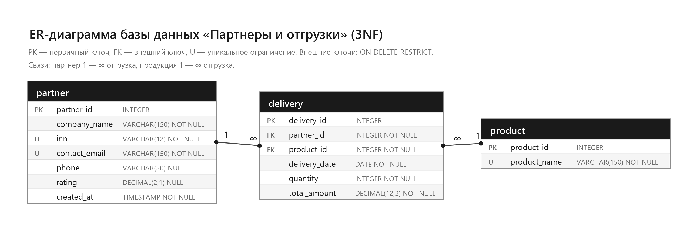

# База данных «Партнеры и отгрузки»

Учебный проект: проектирование базы данных в 3-й нормальной форме, DDL-скрипт,
очистка и импорт исходных файлов, проверочные SQL-запросы.

PostgreSQL 18, скрипт очистки данных — Python 3.10.

## Состав проекта

| Файл | Назначение |
| --- | --- |
| `docs/er_diagram.pdf` | Задание 1: ER-диаграмма в PDF |
| `docs/er_diagram.png` | Задание 1: та же диаграмма картинкой |
| `docs/make_er_diagram.ps1` | Скрипт, которым построена диаграмма |
| `schema.sql` | Задание 2: DDL-скрипт (DROP, CREATE, ключи и ограничения) |
| `etl.py` | Задание 3: очистка исходных файлов |
| `import.sql` | Задание 3: импорт подготовленных данных командой COPY |
| `import_check.sql` | Задание 3: проверочные запросы `SELECT COUNT(*)` |
| `queries.sql` | Задание 4: три запроса будущего приложения |
| `data/import_*` | Исходные файлы из задания |
| `data/clean_*` | Подготовленные к импорту файлы |
| `data/rejected_rows.csv` | Строки, которые импортировать нельзя, с причинами |

## Как развернуть у себя

```
psql -U postgres -c "CREATE DATABASE partners_db"
psql -U postgres -d partners_db -f schema.sql
python etl.py
psql -U postgres -d partners_db -f import.sql
psql -U postgres -d partners_db -f import_check.sql
psql -U postgres -d partners_db -f queries.sql
```

На Windows перед запуском psql полезно задать кодировку, иначе русский текст
в файлах читается неверно:

```
set PGCLIENTENCODING=UTF8
```

## Задание 1. Схема БД в 3NF и ER-диаграмма



Диаграмма в PDF: [docs/er_diagram.pdf](docs/er_diagram.pdf).

Три сущности:

- `partner` — партнеры: название, ИНН, контакты, рейтинг;
- `product` — справочник продукции;
- `delivery` — отгрузки: какая продукция, какому партнеру, когда, сколько
  штук и на какую сумму.

Почему схема в 3NF:

- **1NF** — все поля атомарны: телефон, ИНН и почта хранятся отдельными
  полями, в одной ячейке не лежит список значений.
- **2NF** — у каждой таблицы простой первичный ключ, составных ключей нет,
  поэтому частичных зависимостей от части ключа не существует.
- **3NF** — название продукции вынесено в `product`, в `delivery` остался
  только `product_id`. Иначе название зависело бы от `product_id`, а тот —
  от `delivery_id`, то есть появилась бы транзитивная зависимость. По той же
  причине в `delivery` не хранятся название и ИНН партнера.

Ограничения целостности:

| Таблица | Ограничения |
| --- | --- |
| `partner` | PK `partner_id`; UNIQUE `inn`, `contact_email`; NOT NULL на название, ИНН и почту; CHECK на формат ИНН (10 или 12 цифр), формат почты и рейтинг 0–5 |
| `product` | PK `product_id`; UNIQUE и NOT NULL на `product_name` |
| `delivery` | PK `delivery_id`; FK на `partner` и `product` с `ON DELETE RESTRICT`; NOT NULL на все поля; CHECK `quantity > 0` и `total_amount >= 0` |

`ON DELETE RESTRICT` выбран сознательно: партнера или продукцию, по которым
есть отгрузки, нельзя удалить — история поставок должна остаться целой.

Схема именования: `snake_case`, названия таблиц в единственном числе,
первичный ключ — `<таблица>_id`, внешний ключ повторяет имя ключа родителя.

## Задание 2. DDL-скрипт

Скрипт `schema.sql` разворачивает структуру с нуля:

1. `DROP TABLE IF EXISTS` в обратном порядке зависимостей — сначала
   `delivery`, потом `product` и `partner`, иначе внешние ключи не дадут
   удалить таблицы.
2. `CREATE TABLE` с типами: `VARCHAR` для текста, `INTEGER` для количества,
   `DATE` для даты отгрузки, `TIMESTAMP` для времени создания записи,
   `DECIMAL(12, 2)` для суммы поставки.
3. Все ограничения заданы явно и с именами (`partner_pk`, `partner_inn_uk`,
   `delivery_partner_fk` и так далее), чтобы ошибки в приложении были
   понятными.

Идентификаторы объявлены как `GENERATED BY DEFAULT AS IDENTITY`: это
стандарт SQL, и он позволяет при импорте вставить номера из исходных файлов,
а потом продолжить нумерацию автоматически.

## Задание 3. Подготовка данных и импорт

Что нашлось в исходных файлах и что с этим сделано:

| Что нашли | Где | Решение |
| --- | --- | --- |
| Лишние пробелы вокруг названия | партнеры 1 и 3 | обрезаны |
| Пустой телефон | партнер 2 | записан NULL |
| Два формата телефона: `+7 (999) 111-22-33` и `+78125554433` | партнеры 1 и 3 | приведены к виду `+7XXXXXXXXXX` |
| Пустой рейтинг | партнер 3 | записан NULL |
| Дата `15.03.2026` вместо ISO | отгрузка 102 | приведена к `2026-03-15` |
| Отгрузка на партнера `4`, которого нет в справочнике | отгрузка 104 | отклонена: внешний ключ не позволил бы ее импортировать |
| Повторяющиеся названия продукции | отгрузки 101/104 и 102/105 | вынесены в справочник `product` |

Проверки при очистке: формат ИНН (10 или 12 цифр), формат почты,
дубликаты по ИНН и почте, дубликаты номеров отгрузок, положительное
количество и корректная сумма.

Запуск очистки:

```
python etl.py
```

```
Партнеры: подготовлено строк 3
Продукция: подготовлено строк 3
Отгрузки: подготовлено строк 4
Отклонено строк: 1
  import_sales.txt, строка 5: партнера 4 нет в справочнике
```

Импорт выполняется командой `COPY` (в psql — `\copy`), после импорта
счетчики идентификаторов сдвигаются на максимальный номер:

```
psql -U postgres -d partners_db -f import.sql
```

```
SET
COPY 3
COPY 3
COPY 4
```

Проверка полноты импорта:

```
psql -U postgres -d partners_db -f import_check.sql
```

```
 table_name | row_count
------------+-----------
 delivery   |         4
 partner    |         3
 product    |         3
(3 rows)

 orphan_delivery_count
-----------------------
                     0
(1 row)

 first_delivery | last_delivery | deliveries_amount
----------------+---------------+-------------------
 2026-03-01     | 2026-03-25    |          67000.50
(1 row)
```

## Задание 4. Проверочные SQL-запросы

**1. Список партнеров по алфавиту и количество их отгрузок** (`LEFT JOIN`
и `COUNT`, партнер без отгрузок тоже попадает в список):

```
 partner_id |      company_name       |    inn     |      contact_email      | delivery_count
------------+-------------------------+------------+-------------------------+----------------
          2 | ИП Петров А.В.          | 5001098765 | petrov_delivery@mail.ru |              1
          1 | ООО "Логистик-Экспресс" | 7701234567 | info@logex.ru           |              2
          3 | ТК "Быстрый Путь"       | 7812345678 | speedway@yandex.ru      |              1
(3 rows)
```

**2. Транзакция**: в одном блоке `BEGIN ... COMMIT` создается новый партнер,
его первая отгрузка и обновляется рейтинг. Либо в базе появится все, либо
ничего:

```
BEGIN
INSERT 0 1
INSERT 0 1
UPDATE 1
COMMIT
```

**3. История отгрузок партнера за период** — названия продукции, даты,
объемы в штуках, сумма каждой поставки и итог за период:

```
      company_name       |        product_name        | delivery_date | quantity | total_amount | period_total
-------------------------+----------------------------+---------------+----------+--------------+--------------
 ООО "Логистик-Экспресс" | Стиральный порошок "Альфа" | 2026-03-01    |       50 |     25000.00 |     35500.00
 ООО "Логистик-Экспресс" | Кондиционер для белья      | 2026-03-20    |       30 |     10500.00 |     35500.00
(2 rows)
```
